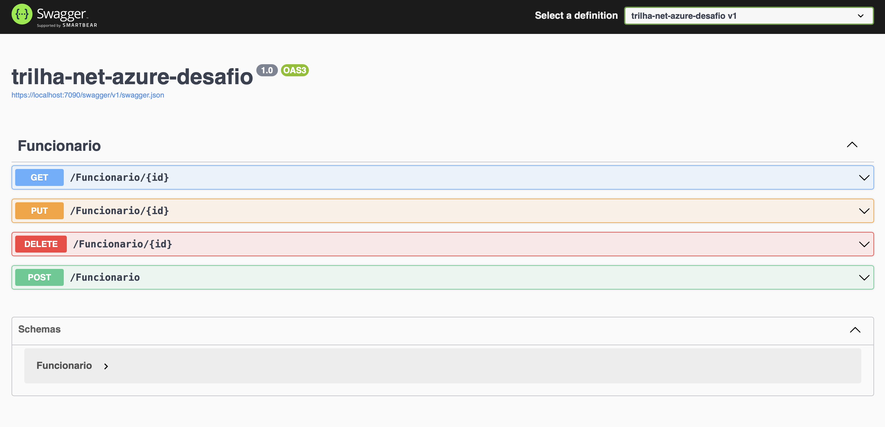
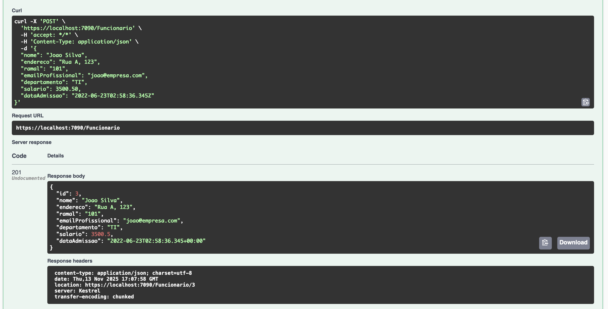
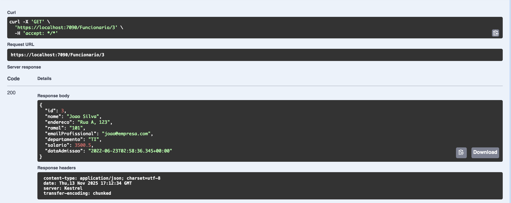
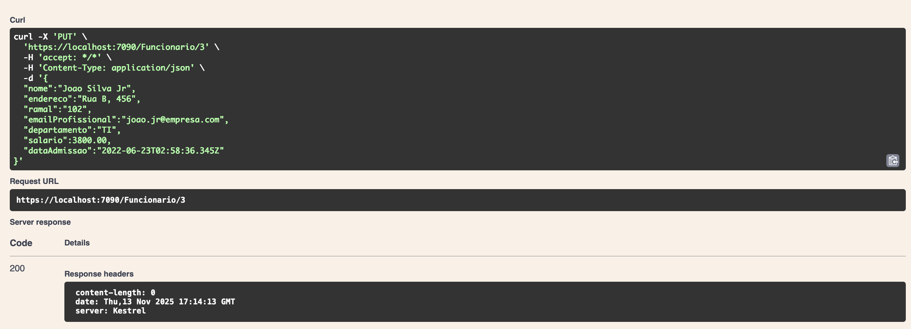
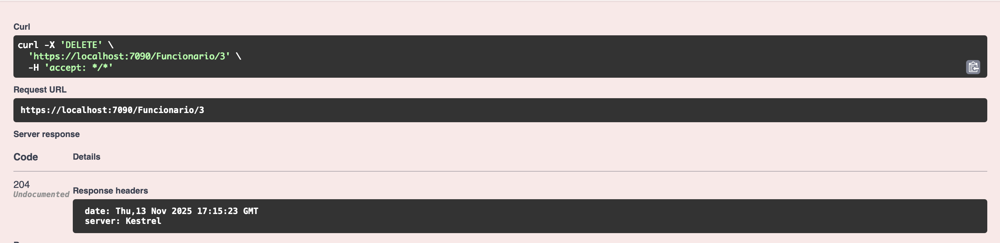

# DIO - Trilha .NET - Nuvem com Microsoft Azure
www.dio.me

## Desafio de projeto
Para este desafio, você precisará usar seus conhecimentos adquiridos no módulo de Nuvem com Microsoft Azure, da trilha .NET da DIO.

## Contexto
Você precisa construir um sistema de RH, onde para essa versão inicial do sistema o usuário poderá cadastrar os funcionários de uma empresa. 

Essa cadastro precisa precisa ter um CRUD, ou seja, deverá permitir obter os registros, criar, salvar e deletar esses registros. A sua aplicação também precisa armazenar logs de toda e qualquer alteração que venha a ocorrer com um funcionário.

## Premissas
A sua aplicação deverá ser do tipo Web API, Azure Functions ou MVC, fique a vontade para implementar a solução que achar mais adequado.

A sua aplicação deverá ser implantada no Microsoft Azure, utilizando o App Service para a API, SQL Database para o banco relacional e Azure Table para armazenar os logs.

A sua aplicação deverá armazenar os logs de todas as alterações que venha a acontecer com o funcionário. Os logs deverão serem armazenados em uma Azure Table.

A sua classe principal, a classe Funcionario e a FuncionarioLog, deve ser a seguinte:


A classe FuncionarioLog é filha da classe Funcionario, pois o log terá as mesmas informações da Funcionario.

Não se esqueça de gerar a sua migration para atualização no banco de dados.

## Métodos esperados
É esperado que você crie o seus métodos conforme a seguir:


**Swagger**


**Endpoints**


| Verbo  | Endpoint                | Parâmetro | Body               |
|--------|-------------------------|-----------|--------------------|
| GET    | /Funcionario/{id}       | id        | N/A                |
| PUT    | /Funcionario/{id}       | id        | Schema Funcionario |
| DELETE | /Funcionario/{id}       | id        | N/A                |
| POST   | /Funcionario            | N/A       | Schema Funcionario |

Esse é o schema (model) de Funcionario, utilizado para passar para os métodos que exigirem:

```json
{
  "nome": "Nome funcionario",
  "endereco": "Rua 1234",
  "ramal": "1234",
  "emailProfissional": "email@email.com",
  "departamento": "TI",
  "salario": 1000,
  "dataAdmissao": "2022-06-23T02:58:36.345Z"
}
```

---

## 🚩 RESOLUÇÃO DO DESAFIO — ETAPA FINAL (TESTES EVIDENCIADOS)

> **Atenção:** Esta seção foi gerada após a execução e validação completa do desafio. Aqui você encontra o passo a passo final, com prints reais dos testes dos endpoints, para facilitar a conferência e o entendimento de qualquer pessoa que acessar este repositório.

### 1. Tela inicial do Swagger da aplicação



---

### 2. Teste de criação de funcionário (POST /Funcionario)

- Requisição enviada:
```json
{
  "nome": "Joao Silva",
  "endereco": "Rua A, 123",
  "ramal": "101",
  "emailProfissional": "joao@empresa.com",
  "departamento": "TI",
  "salario": 3500.50,
  "dataAdmissao": "2022-06-23T02:58:36.345Z"
}
```
- Resposta esperada: **201 Created**
- Print do resultado:



---

### 3. Teste de consulta de funcionário (GET /Funcionario/{id})

- Exemplo de consulta: `/Funcionario/3`
- Resposta esperada: **200 OK** com o JSON do funcionário
- Print do resultado:



---

### 4. Teste de atualização de funcionário (PUT /Funcionario/{id})

- Requisição enviada:
```json
{
  "nome": "Joao Silva Jr",
  "endereco": "Rua B, 456",
  "ramal": "102",
  "emailProfissional": "joao.jr@empresa.com",
  "departamento": "TI",
  "salario": 3800.00,
  "dataAdmissao": "2022-06-23T02:58:36.345Z"
}
```
- Resposta esperada: **200 OK**
- Print do resultado:



---

### 5. Teste de remoção de funcionário (DELETE /Funcionario/{id})

- Exemplo de remoção: `/Funcionario/3`
- Resposta esperada: **204 No Content**
- Print do resultado:



---

**Todos os endpoints foram testados e funcionam conforme esperado, incluindo persistência no SQL Server e logs no Azure Table (emulado via Azurite).**

> **Dica:** Para rodar localmente, siga as instruções de configuração de ambiente e utilize as mesmas rotas e exemplos acima. Se precisar de mais detalhes, consulte o histórico deste README ou abra uma issue.
